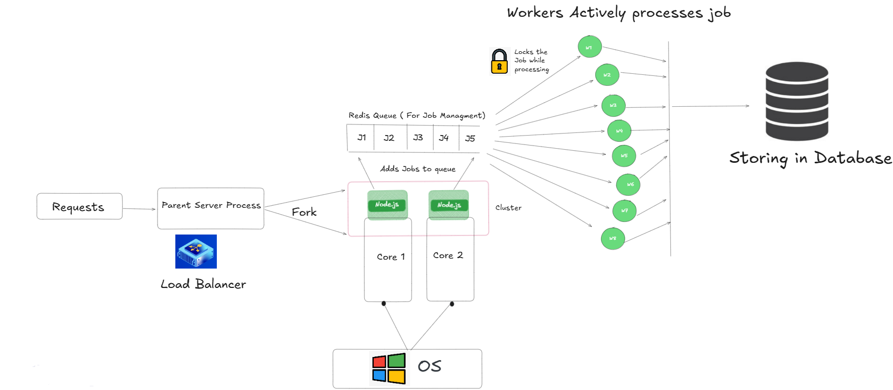

<div style="display: flex; align-items: center;">
  
  <h1 style="margin-left: 10px;">Unolo Backend Assignment</h1>
</div>

## 🛠️ Tech Stack

- **TypeScript**: Typed superset of JavaScript
- **Node.js**: JavaScript runtime
- **Express**: Web framework for Node.js (Backend)
- **SuperBase**: SQL Database
- **Prisma**: ORM for database management
- **Redis**: Used for caching images and for queuing mechanism
- **Cluster Module**: For creating multiple workers for parallelism
- **Artillery**: For load testing the application
- **Sharp**: High-performance image processing library
- **UUID**: Library for generating unique identifiers
- **moment-timezone**: For converting UTC to IST with ease
- **axios**: For making API requests

## 🚀 Quick Start

### 🛠️ Backend Setup

1. **Install dependencies:**

   ```bash
   npm install
   ```

2. **Run migrations:**

   ```bash
   npx prisma migrate dev
   ```

3. **Compile the TypeScript files to JavaScript:**

   ```bash
   tsc
   ```

4. **Run the server:**

   ```bash
   npm run start
   ```

5. **Run the worker (in another terminal tab):**

   ```bash
   npm run worker
   ```

## Load Testing Application

### Note

Before load testing, for the ease of load testing, go to `load-test.js` file in `src/load-test` and change the month, day, hour, and minute to the latest time. For example, if the current time is 3:37 PM on 15th Feb 2025 in India, set the month to 1(Not 2 as in js months are 0 based indexed), day to 15, hour to 3, and minute to 38 (for checking if the processes are scheduled or not after 1 minute). Keep the seconds randomized.

### Run Load Testing

Run the following command in another terminal tab:

```bash
artillery run src/load-test/load-test.yaml
```

## 📄 API Documentation

### Create a Job

**Endpoint:** `POST /processJob`

**Request Body:**

```json
{
  "count": 2,
  "scheduled_time": "2025-02-16T10:57:00+05:30",
  "visits": [
    {
      "store_id": "S00339218",
      "image_url": [
        "https://www.gstatic.com/webp/gallery/2.jpg",
        "https://www.gstatic.com/webp/gallery/3.jpg"
      ],
      "visit_time": "10:00:00"
    },
    {
      "store_id": "S01408764",
      "image_url": [
        "https://www.gstatic.com/webp/gallery/3.jpg"
      ],
      "visit_time": "10:05:00"
    }
  ]
}
```

**Response:**

```json
{
  "job_id": "84c4d06e-cd84-4c04-aea3-b8c65e1cdcf1",
  "message": "Job scheduled for processing"
}
```

### Get Job Status

**Endpoint:** `GET /api/status/:jobId`

**Response:**

```json
{
  "job_id": "84c4d06e-cd84-4c04-aea3-b8c65e1cdcf1",
  "status": "ongoing"
}
```

## 🏗️ Architecture

### Visual Understanding

<div style="display: flex; align-items: center;">
  
</div>

### Design Choices

1. **Cluster Module**: The use of the `cluster` module allows the application to take advantage of multiple CPU cores, improving performance and scalability.
2. **Prisma ORM**: Prisma is used for database management, providing a type-safe and efficient way to interact with the database.
3. **Redis**: Redis is used for caching and job scheduling using a queuing mechanism, ensuring fast access to frequently used data and efficient job processing. Even in high concurrency, duplicate job execution is avoided as the workers use a locking system.
4. **Moment-Timezone**: Moment-timezone is used to handle time zone conversions, ensuring that scheduled times are correctly interpreted and stored.

### Trade-offs

1. **Complexity vs. Performance**: The use of the `cluster` module and Redis adds complexity to the application but significantly improves performance and scalability.
2. **Type Safety vs. Flexibility**: Using TypeScript and Prisma provides type safety and reduces runtime errors but requires additional setup and configuration.

## 📄 Assumptions

  - The database schema is predefined and migrations are managed using Prisma. Google-translate-api-x is used instead of the Google Translate API as it is easier to use.

## 🙏 Acknowledgments

- Prisma team for the ORM.
- Express team for the web framework.
- Google Translate API team for the translation service.
